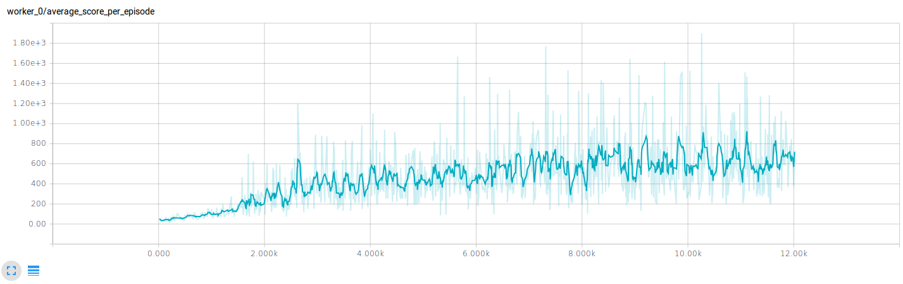
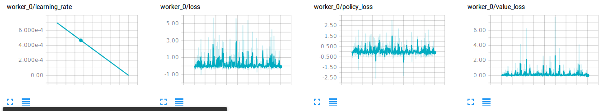
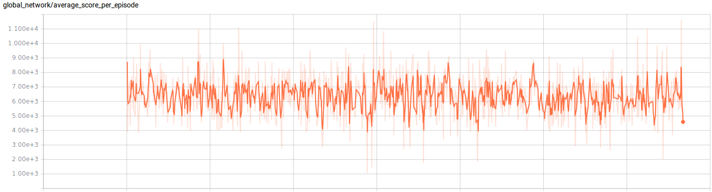

# Asynchronous Actor Critic (A3C) Thensorflow implementation

## Dependencies
- Python 2.x
- TensorFlow r0.12
- Numpy
- Openai gym

## How to run the training algorithm
To run the algorithm using the default parameters

```
$ python train_agent.py
```

- The final model metadata will be saved at:
*./model/\<openai_gym_game_name\>/*

- Tensorboard information regarding **Average score per episode** behaviour during training as well as **losses** and **learning rate dacay** curves will be saved at: *./summary/\<openai_game_name\>/train/*

## Training

The following graph shows the training performance (average score per episode) of our agent running the A3C algorithm on the DemonAttack game.
Note that, each episode finishes when the agent losses a life, therefore the scores shown in the picture may not be directly comparable with other graphs where the episode finishes when the agent loses all of its lives.



Next we see the learning rate decay, policy loss, value loss, and loss (policy + value losses) behavior during training. The formulas for the gradients computation can be found at:

[Asynchronous Methods for Deep Reinforcement Learning](https://arxiv.org/abs/1602.01783)



## Evaluation

The following shows the average score per game during testing. The y-axis represents the total score the agent accomplished while the x-axis the number of games.


